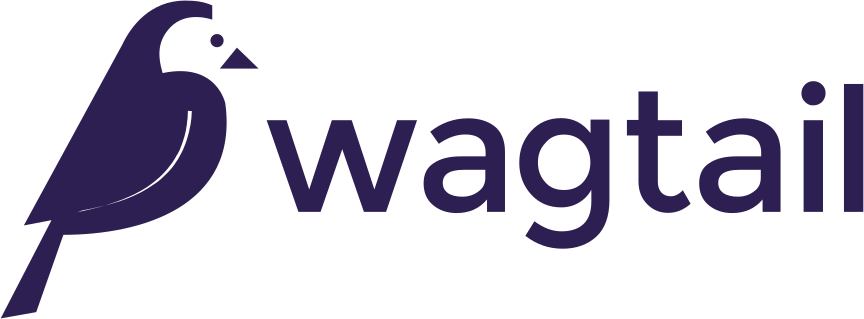
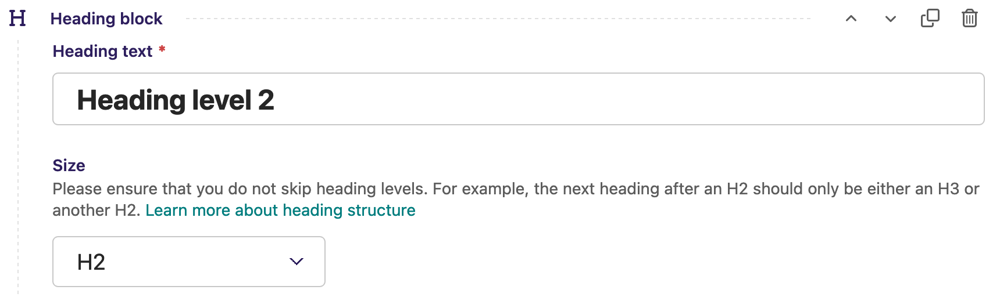
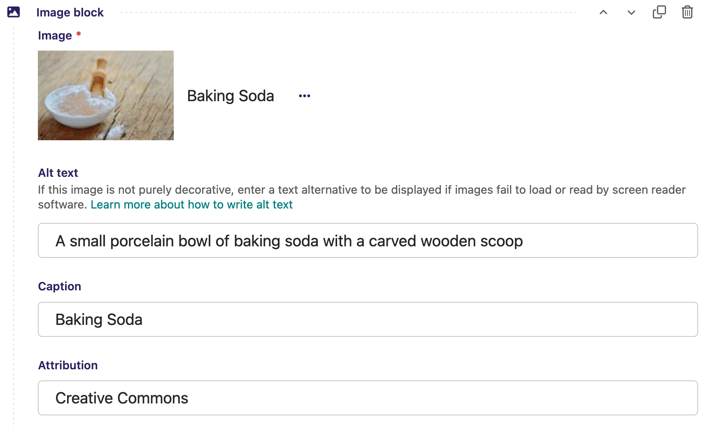
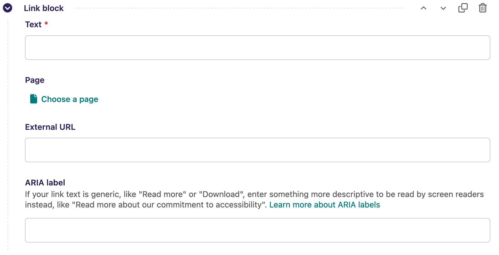

class: title wagtail

# Best Practices for Making<br>a Wagtail Site Accessible
## Scott Cranfill (he/him)
## DjangoCon US 2023

???

Hello, Djangonauts! My name is Scott Cranfill, my pronouns are he/him, and this is my talk on Best Practices for Making a Wagtail Site Accessible.

Ah, but wait, that's not quite right. Let me see…


---

class: title wagtail

# Best Practices for Making<br>a Wagtail Site <span style="color: rgba(255, 255, 255, 0.5)">~~Accessible~~<br><span style="color: #80d7d8">_as Accessible as Possible_</span>
## Scott Cranfill (he/him)
## DjangoCon US 2023

???

There we go! Best practices for making a Wagtail site _as_ accessible _as possible_ – because perfect accessibility is not an achievable goal, but we can keep learning how to do better, and hopefully this presentation will help you with that.


---

# Who am I?

.left-column[

- Full Stack Web Developer at NASA's Jet Propulsion Laboratory
- Resident of Rochester, New York
- Member of the Wagtail Core Team

]
.right-column[




]

.footnotes[

<span style="font-size: 14pt;">BLM ROC logo credit: [www.dunwoode.design](https://www.dunwoode.design/)</span>

]

???

To introduce myself briefly, I work as a full-stack web developer at NASA's Jet Propulsion Laboratory, but I'm speaking here in my personal capacity, not for my employer.

I'm recording this from my home office here in Rochester, in the western part of New York, in the United States, which is closer to Niagara Falls than New York City.

And aside from just using Wagtail at JPL, I'm a member of the Wagtail open source project's Core Team, which means I pitch in on Wagtail development and community building efforts.


---

class: wagtail

# What is Wagtail?

- The leading open-source Python CMS
- Powered by Django
- Free for everyone
- Used by Google, Mozilla, NHS, CFPB

<p style="text-align: center; font-size: 2.5em;">
https://wagtail.org  
https://github.com/wagtail/wagtail
</p>

???

If you're not familiar with Wagtail, it's the leading Python-based, open-source content management system (or CMS), and it's built upon the awesome foundation of Django. It is also 100% free, no matter what you want to use it for!

Aside from JPL, it's used by a number of other well-known organizations, such as Google, Mozilla, the UK's National Health Service, and the U.S. Consumer Financial protection Bureau.


---

# Target audience

- Developers like me who work on Wagtail-powered websites
- Those who might be considering Wagtail

???

I have two target audiences for this talk:

One, developers like me who already work on Wagtail-powered websites and are looking to improve the accessibility of them.

And two, those who might be hearing about Wagtail for the first time, or are already considering it for their next project. Hopefully you will like what you see!


---

# Introduction to accessibility

- Ensuring our web content is able to be consumed by the widest possible spectrum of people
- A legal responsibility for many
  - Domino's Pizza ADA lawsuit.dag1[]
  - Section 508.dag2[]
- A moral responsibility for all

.footnotes[

1. .dag1[] https://www.boia.org/blog/the-robles-v.-dominos-settlement-and-why-it-matters
2. .dag2[] https://section508.gov

]

???

I won't go be giving an exhaustive list of accessibility rules and standards – this talk is about mitigating some of the most common issues I've seen as a developer – but I want to give a high-level overview for those new to the topic. It's easy to find lots of information about accessibility out there, but here's the definition I came up with off the top of my head:

Accessibility is the practice of ensuring that our web content is able to be consumed by the widest possible spectrum of people, with varying abilities and disabilities, whether they are using traditional browsers or assistive technology.

Website owners in many locales have legal obligations to meet certain accessibility requirements. Here in the U.S., we have the Americans with Disabilities Act of 1990, which applies to all websites that serve the general public, as it does to physical facilities that are open to the public. Domino's Pizza was famously sued under this act for their website failing badly at accessibility, eventually settling with the plaintiff for an undisclosed amount of money after a six-year fight that went all the way to the Supreme Court.

And more specifically for government websites, we also have Section 508 of the Rehabilitation Act of 1973 (part of a 1998 amendment to that act). Its latest update requires federal government websites to conform to version 2.0 of the Web Content Accessibility Guidelines (WCAG), level AA or better. WCAG is not just for government sites, though; it's been the world's leading set of web accessibility standards for over two decades now.

But, even if you're not bound by applicable laws in your area, I would argue that as website creators we all have a duty to put some effort into the accessibility of our sites. Building an inclusive world is everyone's responsibility, and web accessibility is one place where us developers can contribute with just a little bit of consideration and effort.

I'll step off the soapbox now and get to the meat of the talk :)


---

# Wagtail’s accessibility initiatives

- Accessibility subteam
- Accessibility statement.dag1[]
- Two prongs:
  - Accessibility of Wagtail itself
  - Accessibility of sites it produces
- Google Summer of Code and Outreachy projects

.footnotes[

1. .dag1[] https://wagtail.org/accessibility

]

???

The Wagtail project has made a pretty serious commitment to accessibility in recent years. It began with the forming of a dedicated subteam in 2020 for working on accessibility issues. This team is led by my fellow Wagtail Core Team member, Thibaud Colas, who has been the number one driver of Wagtail's accessibility efforts. Don't miss his closing talk on Django's Accessibility Track Record at 4 p.m. Eastern, just a couple hours from now!

Our accessibility subteam worked together to devise an accessibility statement for the Wagtail project, which you can find at wagtail.org/accessibility. It explains some specific goals we are striving for and serves as a public declaration of our commitment. In particular, it describes our two-pronged approach of wanting to improve the accessibility of the Wagtail interface itself, and also the accessibility of websites that Wagtail is used to create.

We've also had the pleasure of participating in the Google Summer of Code and Outreachy programs several times now, which has included two accessibility-specific projects (one on each prong):


---

# GSOC and Outreachy projects
- Forced colors support (high contrast mode)
  - GSOC participant: Anuja Raj Verma
  - Mentors: Jane Hughes, Scott Cranfill, Thibaud Colas
- Accessibility checker
  - Outreachy intern: Albina Starykova
  - Mentors: Sage Abdullah, Joshua Munn, Thibaud Colas

???

The first was an improvement to forced colors support in the Wagtail admin (for example, Windows High Contrast Mode), with participant Anuja Raj Verma and mentor Jane Hughes. The second was the creation of an on-page accessibility checker for editors, with participant Albina Starykova and mentors Sage Abdullah and Joshua Munn. (Hopefully you also caught Sage's talk on Monday afternoon!)


---

class: title wagtail

# Accessibility checker demo

???

The accessibility checker, which was added in Wagtail 4.2 early this year, is the hallmark feature of our efforts to improve the accessibility of sites made with Wagtail. It's based on the Axe engine from Deque Systems, which you may be familiar with from its browser extension or tools like Google's Lighthouse, and the goal is to make it easy for content editors to identify accessibility issues that they can address themselves.

Let's take a quick look at it in action!

_[switch to browser]_

This is Wagtail's bakery-themed demo site, which you can find at github.com/wagtail/bakerydemo. I'll just go to the admin area and login here, then return to the homepage and refresh, and now we can see the Wagtail button down here in the lower right. This appears for logged-in users and gives them easy access to different Wagtail functions. This is where the accessibility checker lives, and you can see right away that even our demo is not immune to accessibility issues! What's it telling us here? Our logo isn't contained by a landmark, interesting.

_[switch back to slides]_

As I mentioned, the Wagtail accessibility checker is primarily geared toward helping _content editors_ find things they can correct, but…


---

class: title reverse

# There is still a lot that developers need to do to set their editors up for success

???

**There is still a lot that developers need to do to set their editors up for success!**

And that's going to be the meat of this talk. What are our responsibilities, or what are the guardrails that we can put in place, to help ensure that we end up with a website that's as accessible as possible?


---

# What is still up to developers

- Semantic markup in templates
- Configuring Wagtail's accessibility checker
- Enforcing proper heading hierarchy
- Promoting good alt text
- Using ARIA labels, where appropriate
- Helping editors help themselves

???

I'll quickly go through the list of topics we'll cover:

- Semantic markup in templates
- Configuring Wagtail's accessibility checker
- Enforcing proper heading hierarchy
- Promoting good alt text (and not using it where it's not appropriate)
- Using ARIA labels to add context to links
- and helping editors help themselves


---

# Semantic markup in templates

- Your first responsibility as a developer
- Ensures the ability to navigate around the site in a predictable manner
- Primary concern in a Wagtail context: **landmarks**
- Take advantage of implicit roles.dag1[]

.footnotes[

1. .dag1[] https://www.a11yproject.com/posts/aria-landmark-roles/#html5-implicit-mappings-of-landmark-roles

]

???

Starting with semantic markup in templates:

That error that we saw in the accessibility checker is a good example of needing to start from a base of quality, accessible markup in our templates. The accessibility checker being used diligently by content editors doesn't mean squat if the code that they can't control has major accessibility problems. Semantic markup is crucial for your website to be understood by machines, whether they be assistive technology like a screen reader or things like search engine crawlers.

Your primary concern in the context of templates for a Wagtail site is ensuring that all of the landmarks are in place. That error we got was "All page content should be contained by landmarks" and it was pointing to our main logo.

_[switch back to browser to show that again]_

Let's take a quick look at the template for this part of the page and fix it.

_[switch to VS Code and open `header.html`]_

You can't see the complete rendered HTML in this partial template, but in this case, the issue is that our header `div` does not have a `role="banner"` attribute that would identify it as a banner landmark. An even better solution would be to use the `header` element instead of a `div`, because that comes with an implicit role of banner, making the `role` attribute unnecessary.

_[in `bakerydemo/templates/includes/header.html` change outer `div` to `header`]_

Now that we've updated that, we can refresh the front end and see that the accessibility checker is no longer reporting an issue!

_[switch back to slides]_

I strongly encourage you to take advantage of the implicit roles provided by the new elements that came in with HTML5, primarily `header`, `footer`, `main`, `nav`, and `aside`. They keep your markup cleaner and help avoid a bit of the `div` soup that we so often fall into these days.

We'll have more to cover on semantic markup when we get into the parts that editors have control over when building a page.


---

# Configuring the accessibility checker

- Default is to only show errors that an editor can address
- Bakery demo is set up to show all errors to any user
- Recommendation: configure to show all errors to superusers.dag1[]

.footnotes[

1. .dag1[] https://docs.wagtail.org/en/stable/advanced_topics/accessibility_considerations.html#built-in-accessibility-checker

]

???

There's something I haven't mentioned yet about that error the accessibility checker gave us: by default, on a fresh Wagtail installation, that error would not be shown. Remember, the accessibility checker's primary audience is for content editors to preview the pages they are building and identify changes they need to make in their content. Errors of the kind that we saw – missing landmarks – are not something editors can help with, so that wouldn't be shown.

But the accessibility checker is configurable to show _more_ kinds of errors – all of the kinds of errors supported by the Axe engine – and that is how the bakery demo is set up.

I recommend that you, as a Wagtail developer, configure your site similarly so that as you personally browse the site, you can catch errors that may need to be addressed through code, rather than content. There is a handy recipe in the Wagtail docs for this, linked at the bottom of this slide.


---

class: title reverse

# Heading hierarchy

???

Let's move on to one of the most common accessibility errors out there, but an easy one to address: incorrect heading hierarchy.

_[return to bakerydemo in browser and navigate to Breads]_

I'll demonstrate a couple common errors on the bakery demo, one that is a developer responsibility and one that is an editor responsibility.

If we take a look at this Breads page here, you see we're getting an error for incorrect heading hierarchy, and it's pointing to the heading on this first listed bread, bolani. The issue here is that we have our H1, Breads, up here, but we're skipping right to H3 on these bread cards, with no H2 between. Screen readers and site crawlers rely on having a logical document structure to understand the content of your page, and the headings are the primary way in which they interpret that structure. One way to think about this is like a big, multi-level, numbered outline in a Word document. If you indented two levels at once, that would look pretty strange, wouldn't it? Similarly, webpage headings should avoid skipping levels, as they create the outline of the page.

So, the checker is telling us we have this error, but if we look at this page's edit view,

_[switch tabs to "Editing Breads index page"]_

you can see that there is nothing they can do about it, because this page is coded to automatically pull in these cards, and the heading level is hard coded in the template. Let's take a look at that.

_[switch to VS Code and open `listing-card.html`]_

I'll update the heading from `h3` to `h2` here in this template, save,

_[switch back to browser and reload]_

and reload, and you can see that the error has gone away. The text has gotten a bit bigger, but you can either live with that, or make a simple tweak to the CSS to bring the text back down to the size it was before.

_[navigate to Blog -> The Great Icelandic Baking Show]_

Now if we go to one of our blog pages here, we have another heading hierarchy issue, and this one IS an editor-controlled issue, where the first heading entered into the page content is an H3, instead of an H2.

_[switch tabs to "Editing Blog page"]_

Switching over to the editor, we see that this is entered into a Heading Block in a StreamField. (To digress briefly, StreamField is a Wagtail feature that lets you add any number different kinds of content blocks to a page, such as the heading, paragraph, and image blocks you see here. It's a way of providing a little more structure than a classic open WYSIWYG editor).

Wagtail 5.0 introduced some new ways to validate StreamField blocks (hat tip to Wagtail core developer Matt Westcott), and using these it's pretty simple to validate on save whether or not the headings in a StreamField are in a proper order.

_[return to VS Code and open `blocks.py`]_

Here in our `blocks.py` file, we have this `BaseStreamBlock` class that defines a common set of StreamField blocks for all of the StreamFields on the site. In a pattern that may be familiar to you if you're experienced in Django, you can override the `StreamBlock` parent class's `clean()` method that is used to try to validate the StreamBlock on save.

Rather than write it on the fly, I'll paste in this code that I've pre-written.

_[copy and paste from VS Code on secondary display to VS Code in recording]_

What I've written here is some logic that loops through all of the child blocks in the StreamBlock we're saving, and if they're a heading block, store their size in a list of headings (which I prepopulated with a placeholder for the H1 that isn't part of the StreamField). Then we can loop through the list of headings, starting at the _second_ heading in the list, and compare its size to the previous heading's size. If the difference is greater than 1, we have identified an error in the heading hierarchy, so we add that to the errors dictionary, and then raise a `StreamBlockValidationError` at the end if that dictionary isn't empty. Now if I save this,

_[return to browser]_

and return to the editor here, you'll see that if I try to save this page again, with its existing hierarchy issue, it will throw a validation error and prevent the save. Pretty cool! I can swap it to an H2, and you'll see it save successfully. Then I can add an H4 below, skipping H3, and see that that will again throw a validation error.

_[return to slides]_


---

# Heading hierarchy

- Sometimes a developer responsibility
- Sometimes an editor responsibility
- Use custom validation to guide editors
  - Heading blocks and `RichTextBlock`s (override StreamField's `clean()`)
  - RichTextFields (subclass it and override `clean()`)
  - Both (override page model's `clean()`)

???

So, heading hierarchy issues are sometimes the responsibility of developers like you, and sometimes the responsibility of editors, but in the latter situation, you can use custom validation to help them out.

I demonstrated how it can be done for a heading block – which is not something baked into Wagtail, but a common pattern – but the same approach could be applied to the built-in `RichTextBlock` with headings enabled. You would inspect the rendered markup from the block, looping through the heading elements and doing the same sort of comparison as I did for our heading blocks.

Wagtail also has `RichTextField`, a standard Django model field that can be used to provide a rich text editor outside of a StreamField. In that situation, you could subclass `RichTextField` and add your own custom `clean()` method.

If you have a page that support combinations of the above, you can override the page model's `clean()` method, looping through it all to build a complete list of headings on the page and then checking each of those in succession.

Let's move out of the realm of issues that the accessibility checker will flag and onto a topic that always gets a lot of attention…


---

class: title wagtail

# Alt text


``&nbsp;&nbsp;&nbsp;&nbsp;&nbsp;alt="An illustrated spaceship with a dome on top &nbsp;&nbsp;&nbsp;&nbsp;&nbsp;&nbsp;&nbsp;&nbsp;&nbsp;&nbsp;being flown by the Wagtail bird mascot"`</span>`>`

???

Alt text!

If you're not familiar, alt text is a way to provide a _textual alternative_ of an image to screen readers, not displayed visibly, so that people who cannot see the image can hear what it is depicting. This is done using the `alt` attribute on an `img` element.

The key question to ask yourself when considering alt text for an image is, "What description of this image would be useful to someone who's hearing this page read aloud?" And bear in mind that the answer may be _none._ Decorative images do not need alt text if hearing a description of them would not be useful. However, all `img` elements should have an `alt` attribute, and it should be left empty if the image is decorative.

You can find many many articles on when and how to use alt text, but let's discuss how to implement it in Wagtail.


---

# Alt text in Wagtail

- Default image model does not provide a field for alt text
- Alt text is automatically set to the image's title field when using `` template tag
- Early advice: create a custom image model to add alt field.dag1[]
- Current thinking: **don't** add to model because alt text should be _contextual_

.footnotes[

1. .dag1[] https://docs.wagtail.org/en/stable/advanced_topics/images/custom_image_model.html

]

???

Wagtail has never had a field for alt text in its default image model, but it will default to using an image's title for the alt text if you render an image with Wagtail's standard `` template tag. We know this isn't great, because the title you want to see in the admin interface may have no relation to useful alt text.

In Wagtail's early years, the standard advice was to use a custom image model, instead of the default, and add in your own field for alt text, along with other fields you might need on your images, such as caption or credit fields.

More recently, we have determined that it's a _good_ thing for there not to be an alt text field on the image itself, because any given image may be used in multiple places on a site, and it's important that alt text be relevant to the context the image is in. The context could be different from page to page, so having a single piece of alt text for an image would make it hard to write alt text that is suitable for any usage.

You should probably still set up a custom image model when starting a new Wagtail project, even if you're not sure whether you need additional fields, because it's much harder to transition to one after real image content gets into the database.


---

# Current recommended approach to alt text

- Create your own StreamField image block with an alt field for maximum flexibility
- Keep an eye out for "contextual alt text".dag1[]

.footnotes[

1. .dag1[] https://github.com/wagtail/rfcs/pull/51

]

???

So, because we don't want to store alt text on the image itself, and because we want to override the automatic generation of alt text from the image title, we need to set up a way to set alt text in each place an image is used. For Wagtail StreamFields, this means that the best approach is to create a custom image block that incorporates an image chooser and an optional alt text field.

_[switch back to browser and switch to tab "Editing Blog page"]_

Now, you may have noticed earlier, but the bakery demo already has a custom image block in its StreamField! Here's one on this blog post we've been dealing with. You can see that it has caption and attribution fields already.

_[switch to rendered page]_

And here's another look at how they render on the front end. If we inspect this image, you can see that the `alt` attribute is set to "Baking Soda", the title of the image. One problem with this specific example is that screen readers are going to repeat themselves, reading "Baking Soda" for the image alt and then immediately again for the caption that's visible here on the page. Let's add a dedicated alt field so we can give this some better alt text.

_[return to VS Code and scroll up in `blocks.py` to the `ImageBlock` near the top]_

Here's the Python class for the image block. You can see the three fields we already saw in the editor (child blocks, actually): the image chooser block, and the caption and attribution `CharBlock`s. Let's add another `CharBlock` here for alt text. _[type the new code]_

Then we'll just need to edit the block-specific template to make use of it.

_[switch to `image_block.html`]_

Here in this `` tag, we can pass in an `alt` attribute to override the default of the image title, and we'll set it to our new `alt_text` child block.

_[switch back to the browser]_

Now we can return to the editor, put in some better alt text, something like "A small porcelain bowl of baking soda with a carved wooden scoop", that'll do. Now we publish this, and if we go refresh the page, we can see our new alt text here in the inspector.

_[return to slides]_

So, that's the primary alt text recommendation I have for you – ensure that you have a place to enter it alongside every StreamField image chooser block.

Hopefully this will get a bit easier in the future. Keep an eye on our proposal for a new contextual alt text feature that would eliminate the need for developers to add their own alt text fields. Or comment on it! More enthusiasm from the community might help nudge it into existence more quickly :)


---

class: title wagtail

# ARIA labels

`<dt>2023 Annual Report</dt>`  
`<dd>`  
`&nbsp;&nbsp;&nbsp;&nbsp;<a href="annual-report-2023.pdf">Download</a>`  
`</dd>`  
`<dt>2022 Annual Report</dt>`  
`<dd>`  
`&nbsp;&nbsp;&nbsp;&nbsp;<a href="annual-report-2022.pdf">Download</a>`  
`</dd>`

???

Our final major topic is on the subject of ARIA labels. ARIA stands for Accessible Rich Internet Applications, and it's a set of HTML features that define ways to make web content and web applications more accessible. The landmarks we discussed earlier are also part of ARIA.

Consider the snippet shown here, an excerpt from a list of annual reports. For your average sighted user, it makes perfect sense to have the text of these links simply be "Download", because the visual association with the report they belong to will be readily apparent. But if you're a screen reader user and you're tabbing through all of the focusable elements on the page, you're going to get this list and all you're going to hear is, "Download. Download. Download. Download." … _Download what??_ Imagine how frustrating that would be.

Fortunately, we can do something about it!


---

class: title wagtail

# ARIA labels

`<dt>2023 Annual Report</dt>`  
`<dd>`  
`&nbsp;&nbsp;&nbsp;&nbsp;<a href="annual-report-2023.pdf"`  
`&nbsp;&nbsp;&nbsp;&nbsp;&nbsp;&nbsp;&nbsp;`<span style="color: #80d7d8">`aria-label="Download 2023 Annual Report"`</span>`>`  
`&nbsp;&nbsp;&nbsp;&nbsp;&nbsp;&nbsp;&nbsp;&nbsp;Download`  
`&nbsp;&nbsp;&nbsp;&nbsp;</a>`  
`</dd>`

???

We can use the `aria-label` attribute to change how a screen reader announces this link. With that in place, instead of just reading "Download", it will say "Download 2023 Annual Report."

This sort of repetitive link issue can crop up often. Other common examples include things like "Read more", "Go", "Edit", and so on.

Let's talk about some approaches to handling ARIA labels in Wagtail.


---

# ARIA label hardcoded in a template

```django
<dl class="download-list">
  
    <dt>{{ document.title }}</dt>
    <dd>
      <a href="{{ document.url }}"
         aria-label="Download {{ document.title }}">
        Download
      </a>
    </dd>
  
</dl>
```

???

To continue the example we just gave before, let's say that you're building this list of annual reports using a StreamField `ListBlock` that lets you select any number of files from Wagtail's document library and list those on the page for download.

When declaring your download list `ListBlock`, if you assign a block-specific template and put this code into it, that will give you the neat and tidy visual list, while also automating the `aria-label` attribute to provide more context to screen readers.


---

# ARIA labels entered by editors

```python
class LinkBlock(StructBlock):
    text = CharBlock()
    page = PageChooserBlock(required=False)
    external_url = URLBlock(required=False)
    aria_label = CharBlock(required=False)

    class Meta:
        value_class = LinkStructValue
        template = "blocks/link_block.html"
```

.footnotes[

https://docs.wagtail.org/en/stable/advanced_topics/customisation/streamfield_blocks.html

]

???

Hardcoding in-template works in some situations, but in other situations, we'll need editors to be able to add ARIA labels to their own links. Unfortunately, when working with links in rich text fields, this is not yet possible, but for StreamFields, we can again rely on a custom block setup to get this done.

Creating a LinkBlock is a rite of passage for Wagtail developers, at this point. Everyone eventually wants this sort of block, where you can choose one of several kinds of link destinations, enter your link text, and output the resulting link markup. I borrowed this example from the Wagtail docs page listed below. It's got a required child block for the text of your link, and optional child blocks for either choosing an internal page entering an external URL. You might also want to consider options for linking to a document in Wagtail's document library, email links, or anchor links.

I've also added an ARIA label child block, where editors can enter that if their link warrants it.


---

# ARIA labels entered by editors

```django
<a href="{{ value.url }}"
  
    aria-label="{{ value.aria_label }}"
  >
  {{ value.text }}
</a>
```

???

Then, in our `link_block.html` template, we can conditionally output the `aria-label` attribute if that field has been populated.

How can we help editors know if an ARIA label is needed, though? The answer again is custom validation! You can override the `clean()` method on your `LinkBlock` to check entered link text against a list of _generic_ link text that's unhelpful to hear on its own (things like "read more" and the others I listed earlier) and throw an error if the ARIA label field hasn't also been filled in. Let's take a look at that.

_[switch back to VS Code, copy and paste the LinkBlock main code under the HeadingBlock]_

Here again in our `blocks.py` file, I'll paste in this LinkBlock code I've already prepared, including this custom `clean()` method.

I've got a list of the usual suspects here, the generic link text that I want to look for here, and we're going to check a couple things: First, that we do NOT have anything already in the ARIA label field; and second, we find the entered link text in the generic link text list. If both of those things are true, then we want to raise this validation error, "Entered link text is very generic. Add a more descriptive ARIA label for screen readers."

Before we can see this in action, I just need to import a few more things here,

_[copy and paste whole set of imports]_

and then we need to make this new link block available in `BaseStreamBlock`.

_[type `link_block = LinkBlock()` in after the `embed_block`]_

I'll save that and head back to the edit view.

_[switch back to the browser, change tabs back to "Editing Blog page", and refresh the page]_

Now if I go to add a new block to the StreamField, you'll see the newly-available `LinkBlock`. Insert one of those, and there are the fields we just defined. I'll enter one of our questionably-generic link texts, like "Read more", and then go ahead and try to save. And there's our validation error! Now I can enter something more descriptive, like "Read more about Wagtail", try again to save, and see that it passes validation.

This kind of thing can't prevent an editor from entering a _bad_ ARIA label, but hopefully it will at least prompt them to pause and think about it. Still, we could give them even a little more guidance…

_[switch back to slides]_


---

class: title reverse

# Helping editors help themselves

???

And so, the last subject I want to cover today is about providing timely help to editors as they are editing their page, to help them catch accessibility issues before the checker (or an actual human) reports them.


---

# `help_text`

- Django's built-in tool for providing hints when editing a field

???

Something you may have noticed as I was going through my earlier examples, especially if you're familiar with Django, is that I didn't include any `help_text` attributes, which are a built-in way to provide hints about a given field to the user as they are editing. This was due in part to space constraints and the desire to keep the text large enough to be readable, but normally I am a huge fan of help text! Let's go back and take a look at what we could have done.


---

# Help text on a heading block

```python
size = ChoiceBlock(
    choices=[ ... ], blank=True, required=False,
    help_text=mark_safe(
        'Please ensure that you do not skip heading levels. For example, the next heading after an H2 should only be either an H3 or another H2. <a href="https://www.a11yproject.com/posts/how-to-accessible-heading-structure/">Learn more about heading structure</a>'
    )
)
```

???

Looking back at the `HeadingBlock`, here's an example of the kind of help text I would add to its `size` field (technically a StreamField `ChoiceBlock`, in this case). Note that you can use Django's `mark_safe` utility to be able to include HTML in your help text, which is useful for linking to more detailed guidance.


---

class: screenshot



???

And here's the result in the editor.


---

# Help text on an alt text field

```python
alt_text = CharBlock(
    required=False,
    help_text=mark_safe(
        'If this image is not purely decorative, enter a text alternative to be displayed if images fail to load or read by screen reader software. <a href="https://www.a11yproject.com/posts/alt-text/">Learn more about how to write alt text</a>'
    )
)
```

???

Now returning to the `ImageBlock`, here's an example of the kind of help text I would add to its `alt_text` field.


---

class: screenshot



???

And here's the result in the editor.


---

# Help text on an ARIA label field

```python
aria_label = CharBlock(
    required=False,
    label="ARIA label"
    help_text=mark_safe('If your link text is generic, like "Read more" or "Download", enter something more descriptive to be read by screen readers instead, like "Read more about our commitment to accessibility". <a href="https://a11y-101.com/development/aria-label">Learn more about ARIA labels</a>')
)
```

???

And finally, looking again at the `LinkBlock`, here's an example of the kind of help text I would add to its `aria_label` field.


---

class: screenshot



???

And here's the result in the editor.


---

# `HelpPanel`

- Use for page-level guidance
- Editor panel with no field; just displays any HTML content you define.dag1[]
- Cleaner alternative to help text on every field for things like image-heavy pages

.footnotes[

1. .dag1[] https://docs.wagtail.org/en/stable/reference/pages/panels.html#helppanel

]

???

One other thing that you can do if you're looking to give editors some guidance at the page level, rather than the individual field level, is to add a `HelpPanel`. I won't go too deep into explaining Wagtail editor panels, but in short, a `HelpPanel` has no fields for content entry, it simply lets you define any arbitrary HTML to display to your editors. You could use this, for example, as a cleaner alternative to having `help_text` on every image's alt text field on an image-heavy page type.


---

# Recap

- Use semantic markup in templates
- Configure Wagtail's accessibility checker to show developers all errors
- Enforce proper heading hierarchy
- Add alt text fields and promote better alt text
- Add ARIA label fields and educate editors on when to use them
- Provide timely help to editors as they work on their content

???

Alright, to wrap things up, let's recap my recommendations for you, potential Wagtail developer:

1. Use semantic markup in templates
2. Configure Wagtail's accessibility checker to show developers all errors
3. Enforce proper heading hierarchy
4. Add alt text fields and promote better alt text
5. Add ARIA label fields and educate editors on when to use them
6. Provide timely help to editors as they work on their content


---

class: title wagtail

# Further reading

<p style="text-align: center;">
[https://docs.wagtail.org/en/stable/advanced_topics/<br>accessibility_considerations.html](https://docs.wagtail.org/en/stable/advanced_topics/accessibility_considerations.html)
</p>

???

To learn more about making a Wagtail site as accessible as possible, I strongly recommend you check out this page in the Wagtail docs. In addition to specific technique recommendations like the ones I've given, it also has a list of links to other great resources if you want to learn more about web accessibility.


---

class: title

# Thank you!

<p style="text-align: center;">
https://github.com/Scotchester/djangocon-wagtail-accessibility
</p>

## Questions? Find me in the hallway or on Slack!

???

Thank you very much for watching! I hope you're inspired to make some changes to help your Wagtail sites be more accessible.

You can find these slides and code examples at github.com/Scotchester/djangocon-wagtail-accessibility.

I don't do Twitter anymore and haven't taken the Mastodon plunge yet, but if you have questions, the best place to connect with me would be on the DjangoCon or Wagtail Slack workspaces.

Enjoy the rest of DjangoCon!
